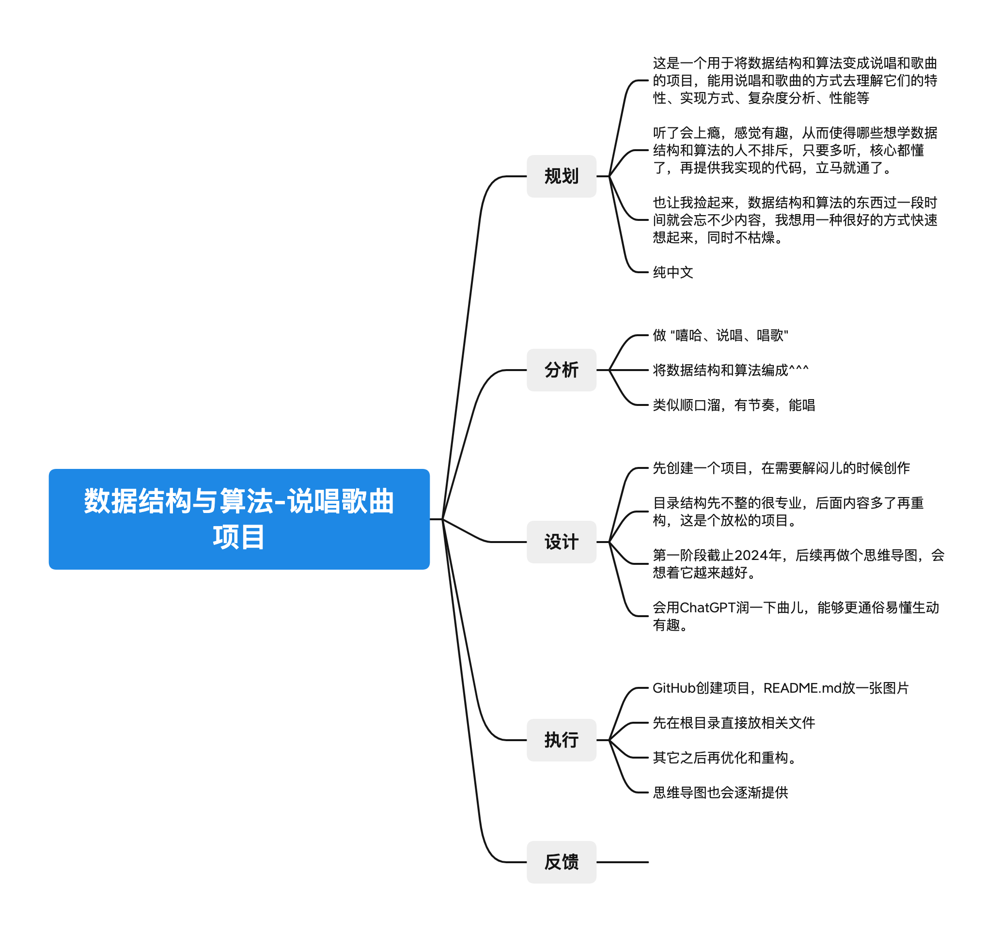

# Data-structures-and-Algorithms-rap-songs

这是一个用于将数据结构和算法变成说唱和歌曲的项目，能用说唱和歌曲的方式去理解它们的特性、实现方式、复杂度分析、性能等

    

## 规划

这是一个用于将数据结构和算法变成说唱和歌曲的项目，能用说唱和歌曲的方式去理解它们的特性、实现方式、复杂度分析、性能等

听了会上瘾，感觉有趣，从而使得哪些想学数据结构和算法的人不排斥，只要多听，核心都懂了，再提供我实现的代码，立马就通了。

也让我捡起来，数据结构和算法的东西过一段时间就会忘不少内容，我想用一种很好的方式快速想起来，同时不枯燥。

纯中文

## 分析

做 “嘻哈、说唱、唱歌”

将数据结构和算法编成^^^

类似顺口溜，有节奏，能唱

## 设计

先创建一个项目，在需要解闷儿的时候创作

目录结构先不整的很专业，后面内容多了再重构，这是个放松的项目。

第一阶段截止2024年，后续再做个思维导图，会想着它越来越好。

会用ChatGPT润一下曲儿，能够更通俗易懂生动有趣。

## 执行

GitHub创建项目，README.md放一张图片

先在根目录直接放相关文件

其它之后再优化和重构。

思维导图也会逐渐提供

## 反馈

